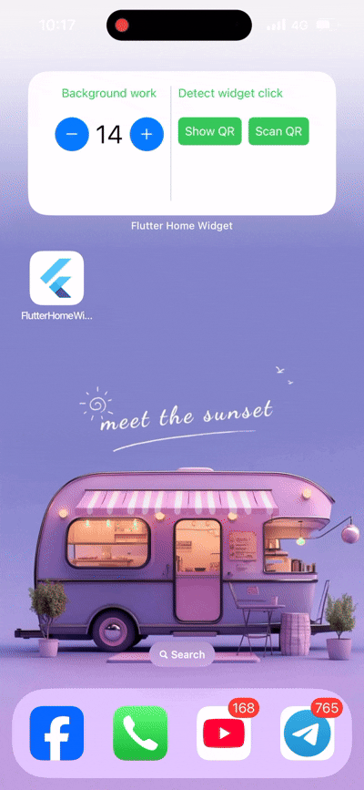
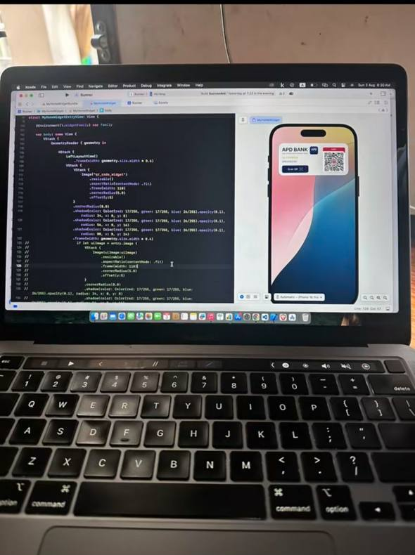

# Flutter iOS Home Widget Implementation

This repository demonstrates how to implement an **iOS Home Screen Widget** for a **Flutter** application using **WidgetKit** and the [`home_widget`](https://pub.dev/packages/home_widget) plugin.

The goal is to share data between Flutter and a native iOS widget and display it on the iOS Home Screen.



<br>
<br>



---

## 🧱 Architecture Overview

```
Flutter App
   │
   │  (home_widget plugin)
   ▼
App Group (UserDefaults)
   ▲
   │
iOS Widget Extension (WidgetKit + SwiftUI)
```

Flutter writes data to the **App Group**, and the Widget reads from the same App Group to render UI.

---

## Requirements

* Flutter 3.x or later
* Xcode 14+
* iOS 14.0+
* macOS
* Apple Developer Account

---

## Setup
For setup guide please visite this 
[Implement iOS Home Widget](https://horleng.vercel.app/blogs/implement-an-ios-home-widget-in-flutter-app)

## 🤝 Contributing

Pull requests are welcome. For major changes, please open an issue first to discuss what you would like to change.

---

Thanks!.
